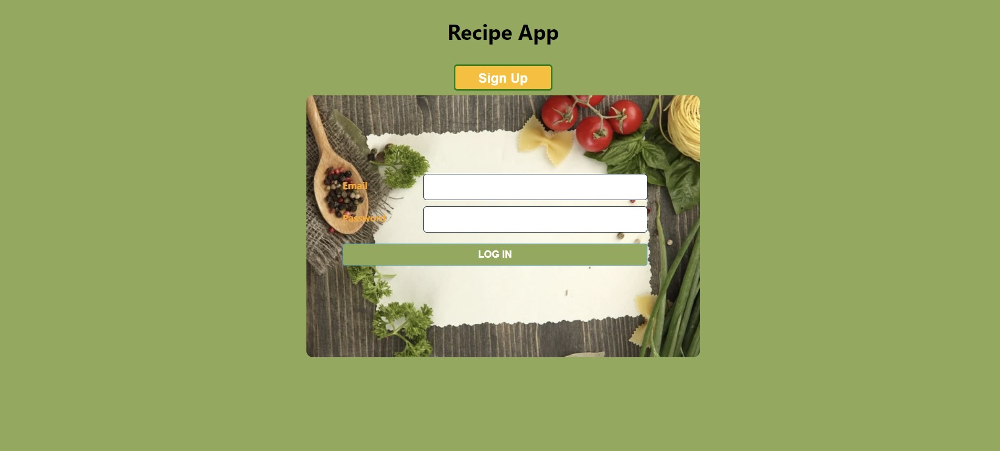
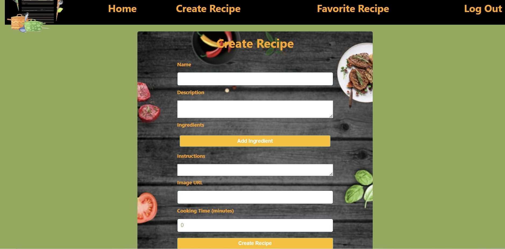
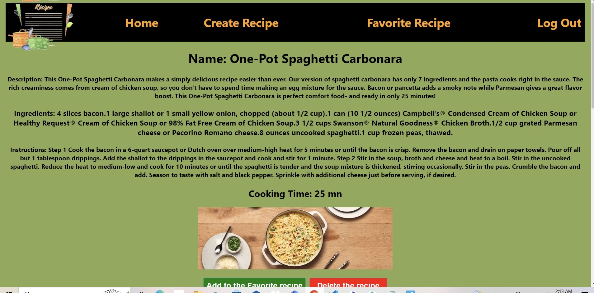

# Project3: A MERN Stack Application 

Create a Recipe App using the MERN (MongoDB, Express.js, React, Node.js) stack is a great way to learn and showcase full-stack development skills. This project involves building a web application that allows users to create, edit and delete recipes. Here's a step by step guide on how to approach this project.

Building a Recipe App using the MERN stack is a comprehensive project that covers various aspects of full-stack web development. it provides valuable experience in working with databases, backend APIs, and frontend UI components while allowing to create a useful and engaging application.

## 1-Project Setup:
Set up the development environment with Node.js and npm installed.
Initialize a new project folder and set up.

## 2-Backend Development (Node.js, Express.js, MongoDB):
#### a. Database Setup: 
Install MongoDB and set up a database to store recipe information.
### b. Server Setup:
Create a new Express.js server that listens for incoming requests.
Set up routes for handling CRUD operations on recipes
Implement data validation and error handling for routes.
### c. Database Models:
a-Define Mongoose models for recipes, favorite and users.
b-Create Routes folder.
c-Create Controllers folders.

### d.Implement user authentication.

## 3-Frontend Development (React):
inside src create folders components, pages and utilities.

## 4- create file .env:
the file .env stores configuration variables and sensitive information that should not be hard-coded into your application's source code. 

## 5- connect to github and Deploy the app using render.com 

## Technologies Used
HTML | CSS | MongoDB | Express | React | Node.js | Mongoose | Axios | Bcrypt | JSON Webtoken |

npx create-react-app "name of the project"

npm start => Starts the development server.

npm run build => Bundles the app into static files for production.

npm test => Starts the test runner.

npm run eject => Removes this tool and copies build dependencies, configuration files
    and scripts into the app directory. If you do this, you can’t go back!

npm i express morgan serve-favicon => Install the Modules for the Express Server.

nodemon server => to run server Backend.

npm i react-router-dom => install react router 

npm i dotenv => .env  file a way to access environment variables and secrets.

npm i mongoose => Install mongoose and Connect to a Database.

npm i bcrypt =>  install and used to hash data.

## Live Deployment: 
https://recipe-app-082p.onrender.com

## Instructions
1-Sign up as a new user or Log in if you already signed up.
2- in NavBar you click create recipe to create any recipes and add all the details, like ingredients , copy an image address and past it in imageUrl. 
3- once the recipe is created you can Click "add to the favorite recipe" button to store it in favorite recipe page.c click "edit the recipe" button to update or you can click " delete" button to delete the recipe.

